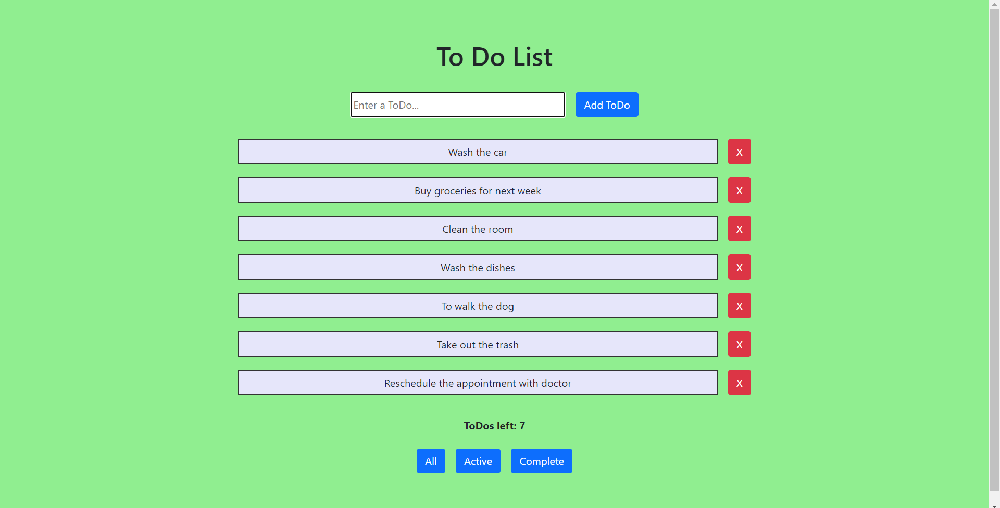
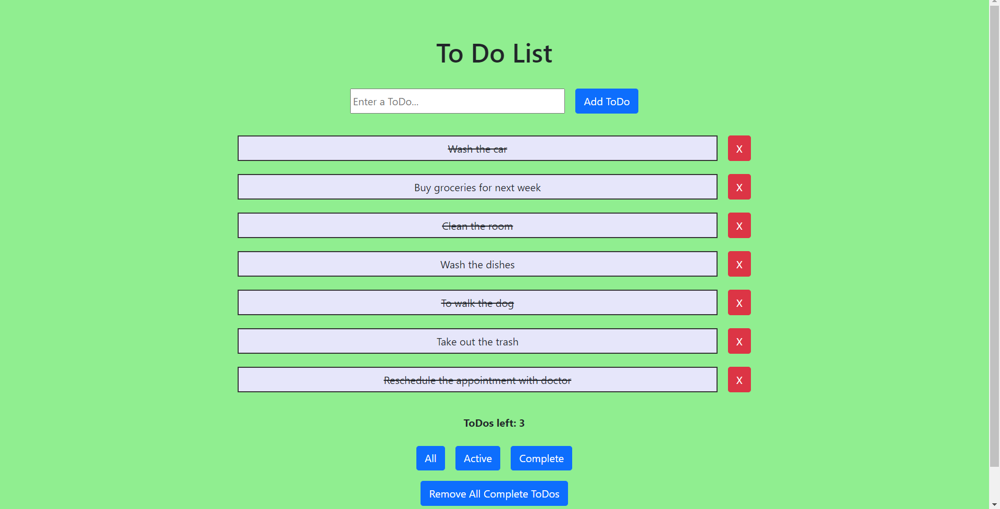
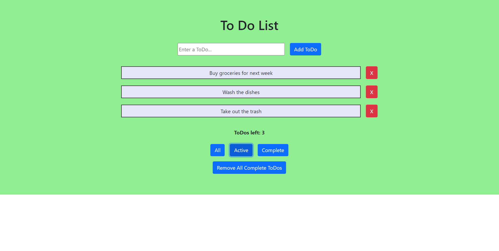
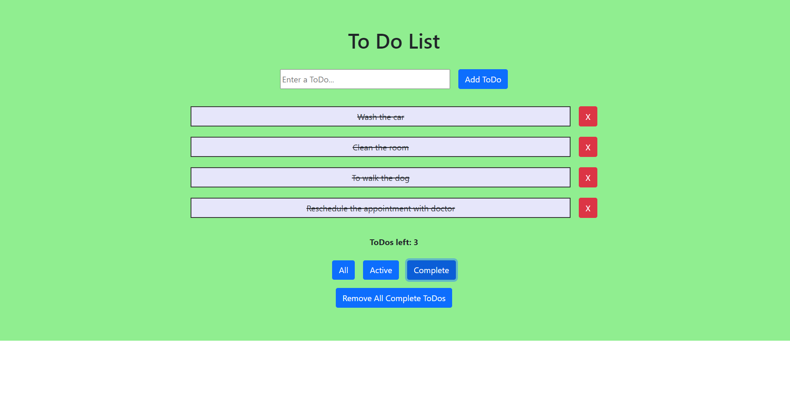
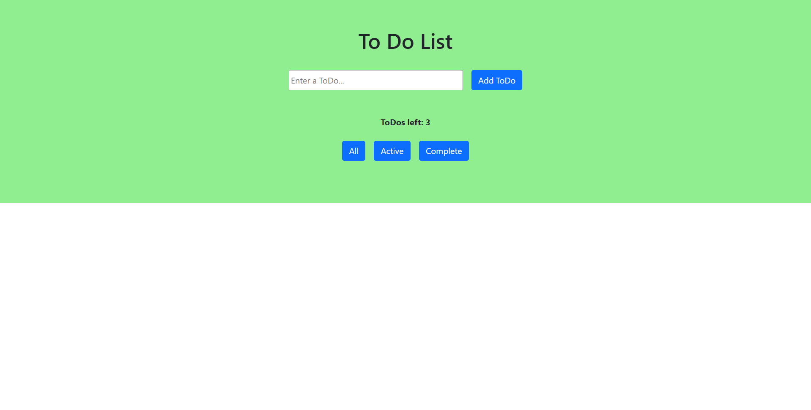
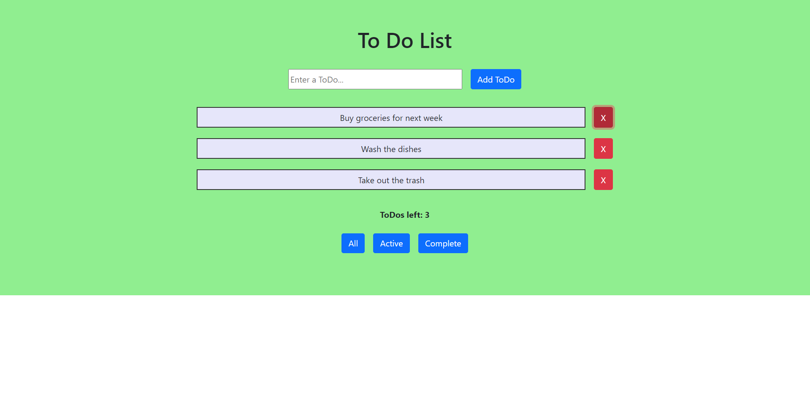
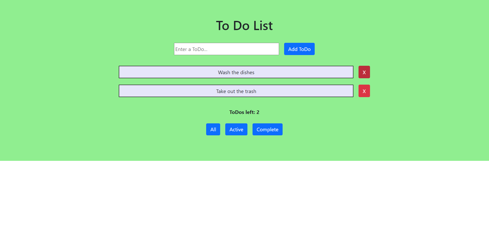

## To-Do List React App

To-Do List with a few To-Dos.

Items get striked-through upon selection, and a button pops up to Remove All Completed To-Dos if needed.

The Active button shows a list of all Active To-Dos, upon click. 

The Complete button shows a list of all completed items.

All completed items are removed, upon selecting the Remove All Completed ToDos button.

Clicking the close button removes the item from the list.

---